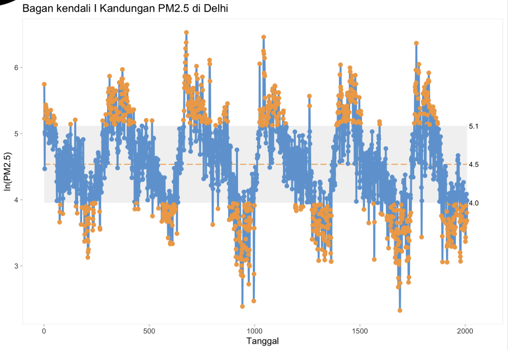
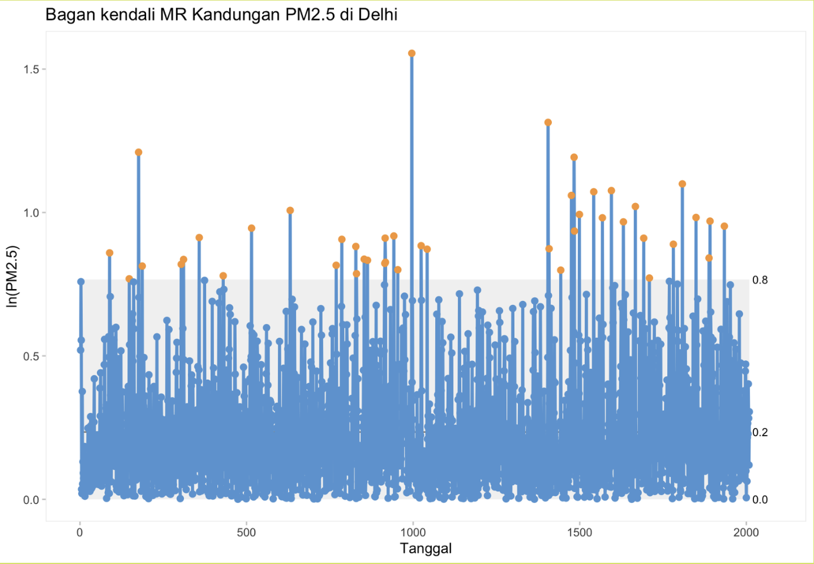
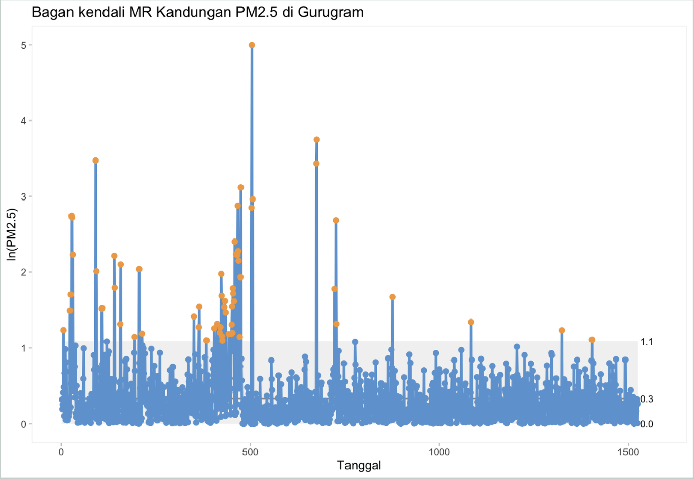

# Statistical Process Control (SPC) Analysis of PM2.5 Concentrations in India

This project applies Statistical Process Control (SPC) techniques to analyze PM2.5 air pollution data from Delhi and Gurugram, India. The objective was to evaluate process stability, detect abnormal variation, and identify out-of-control signals using control chart methodology. The analysis was conducted in R, focusing on I-MR (Individuals–Moving Range) control charts.

## Key findings
1. PM2.5 concentrations exhibited multiple out-of-control signals, indicating significant volatility in pollution levels.
2. Delhi showed higher average concentration and greater variability compared to Gurugram.
3. Several extreme spikes exceeded upper control limits, suggesting episodic pollution events.
4. The process cannot be considered statistically stable over the observed period.

## Individuals Control Chart – Delhi

## Moving Range Chart – Delhi

## Individuals Control Chart – Gurugram

## Moving Range Chart – Gurugram

## Dataset
This project uses the **Air Quality Data in India** dataset, publicly available on Kaggle. The dataset contains hourly and daily air quality measurements for multiple Indian cities, including PM2.5 concentration levels.

Source:  https://www.kaggle.com/datasets/rohanrao/air-quality-data-in-india
